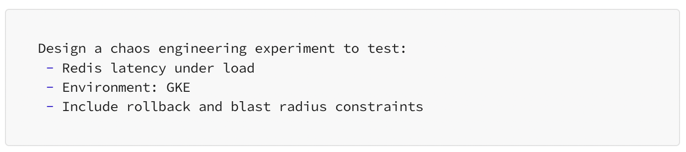

# DevOps-AI-Toolkit


**Supercharge your DevOps, Cloud, and SRE workflows with AI-powered prompts, scripts, and automation.**

---

## About This Toolkit
This GitHub repository is designed to help Cloud Engineers, DevOps practitioners, and SREs accelerate their day-to-day workflows using AI tools like ChatGPT, Claude, and Gemini. It includes real-world prompts, reusable scripts, and automation templates across CI/CD, incident management, cost optimization, monitoring, and more.

---

## Repository Structure
---

## Features
- 20+ AI prompt templates to solve real DevOps problems
- Scripts for automation in AWS, Azure, and on-prem
- Best practices for using AI securely (e.g. sanitizing logs)
- Examples: incident reports, runbooks, postmortems
- Easy to copy-paste and adapt to your stack

---

## Prompt Catalog

### CI/CD Troubleshooting
1. Analyze this GitHub Actions failure. Logs: [Insert]. Stack: Node.js + Yarn. Recent change: `.nvmrc` added.


2. Jenkins job fails during `mvn package`. Console output: [Insert]. OS: Ubuntu.


3. GitLab CI error post Docker base image update. YAML + logs attached.


### Infrastructure as Code
4. Generate Terraform: VPC, EKS cluster, RDS, IAM roles, tagging.


5. Pulumi (TypeScript): AKS, PostgreSQL, Private DNS zone. Modular output.


6. CloudFormation for ECS, ALB, Auto-scaling, and CloudWatch logging.


### Scripting Automation
7. Bash: Backup MySQL, compress, S3 upload, delete old, log errors.


8. PowerShell: Restart IIS, fetch event logs, alert via Teams webhook.


9. Python: Find unused EBS volumes, tag for review, export to CSV.


### Observability Alerting
10. Refactor Prometheus rules: reduce noise, add labels, cover Redis spikes.


11. Optimize Datadog monitors: group by env, add remediation tips.


12. Alerting strategy via SLOs: latency, error rate, saturation. Tools: Grafana + Alertmanager.


### Incident Response
13. Chaos experiment for Redis latency in GKE. Include rollback/blast radius.


14. Nginx 502 error runbook: triage, root causes, rollback, Slack escalation.


15. Blameless postmortem draft: Envoy config error, 3-hour API outage.


### Cloud Costs
16. AWS bill breakdown: EC2 + RDS spend, staging idle, tag enforcement.


17. GCP scheduler: Shut down non-prod clusters 6PM–8AM. Terraform compatible.


18. IAM tagging policy: prevent untagged infra, alert if budget breach.


### Security Sanitization
19. Sanitize logs before sharing with AI: redact secrets, internal IPs.


20. Create synthetic OAuth error logs for AI troubleshooting w/o exposing data.


---

## Getting Started
1. Clone the repo:
```bash
git clone https://github.com/Here2ServeU/DevOps-AI-Toolkit.git
```
2. Explore folders by topic
3. Customize prompts with your own context
4. Integrate with your documentation or use in Slack/Notion/Obsidian

---

## Use Cases
- Debug failed CI/CD jobs with environment-specific context
- Generate Terraform, CloudFormation, or Pulumi templates faster
- Automate backups, log rotation, and alerts
- Write better runbooks and incident documentation
- Optimize cloud spend with AI-assisted audits

---

## Security Reminder
Always remove or mask sensitive info before pasting logs or configs into public AI tools. See `/prompts/security_sanitization.md` for guidance.

---

## Contributing
Pull requests are welcome! If you have powerful prompts or scripts that have saved you hours, please share them.

---

## Let’s Connect
Built by Emmanuel Naweji. Connect with me on [LinkedIn](https://linkedin.com/in/ready2assist) or [follow me on GitHub](https://github.com/Here2ServeU) for more AI + DevOps content.

